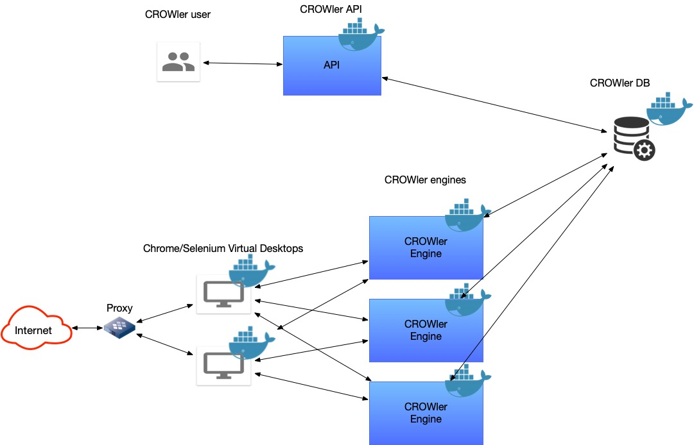

# TheCROWler Architecture

The crowler architecture is a typical microservice based architecture.
The system is divided into multiple services, each responsible for a
specific task. The services communicate with each other using REST APIs.
The system is designed to be easily scalable and deployable in a containerized
environment.

## Components

- **Crowler API** - The main API service that provides an interface for data
queries.
- **Crowler Engine** - The engine service is responsible for crawling the sources
and index them.
- **Crowler DB** - The database service that stores the indexed data.
- **Chrome/Selenium** Virtual Desktops are used to simulate real user interactions.

If you need to scale up the system, you can simply spin up more instances of the
Crowler Engine service and Chrome/Selenium services.

## Architecture diagram

