# TheCROWler DB architecture

The CROWler uses a PostgreSQL database to store the data it collects. However
it's internal data API is designed to be database agnostic, so it could be
easily adapted to use other databases in the future.

Here below is a diagram of the database architecture:

```mermaid
erDiagram
    InformationSeed {
        BIGSERIAL information_seed_id PK
        TIMESTAMP created_at
        TIMESTAMP last_updated_at
        VARCHAR(256) information_seed
        JSONB config
    }

    Sources {
        BIGSERIAL source_id PK
        TIMESTAMP created_at
        TIMESTAMP last_updated_at
        TEXT url
        VARCHAR(50) status
        TIMESTAMP last_crawled_at
        TEXT last_error
        TIMESTAMP last_error_at
        INTEGER restricted
        BOOLEAN disabled
        INTEGER flags
        JSONB config
    }

    Owners {
        BIGSERIAL owner_id PK
        TIMESTAMP created_at
        TIMESTAMP last_updated_at
        VARCHAR(64) details_hash
        JSONB details
    }

    NetInfo {
        BIGSERIAL netinfo_id PK
        TIMESTAMP created_at
        TIMESTAMP last_updated_at
        VARCHAR(64) details_hash
        JSONB details
    }

    HTTPInfo {
        BIGSERIAL httpinfo_id PK
        TIMESTAMP created_at
        TIMESTAMP last_updated_at
        VARCHAR(64) details_hash
        JSONB details
    }

    SearchIndex {
        BIGSERIAL index_id PK
        TIMESTAMP created_at
        TIMESTAMP last_updated_at
        TEXT page_url
        VARCHAR(255) title
        TEXT summary
        VARCHAR(8) detected_type
        VARCHAR(8) detected_lang
    }

    Screenshots {
        BIGSERIAL screenshot_id PK
        BIGINT index_id FK
        TIMESTAMP created_at
        TIMESTAMP last_updated_at
        VARCHAR(10) type
        TEXT screenshot_link
        INTEGER height
        INTEGER width
        INTEGER byte_size
        INTEGER thumbnail_height
        INTEGER thumbnail_width
        TEXT thumbnail_link
        VARCHAR(10) format
    }

    WebObjects {
        BIGSERIAL object_id PK
        TIMESTAMP created_at
        TIMESTAMP last_updated_at
        TEXT object_link
        VARCHAR(255) object_type
        VARCHAR(64) object_hash
        TEXT object_content
        TEXT object_html
        JSONB details
    }

    MetaTags {
        BIGSERIAL metatag_id PK
        VARCHAR(255) name
        TEXT content
    }

    Keywords {
        BIGSERIAL keyword_id PK
        TIMESTAMP created_at
        TIMESTAMP last_updated_at
        VARCHAR(100) keyword
    }

    SourceOwnerIndex {
        BIGSERIAL source_owner_id PK
        BIGINT source_id FK
        BIGINT owner_id FK
        TIMESTAMP created_at
        TIMESTAMP last_updated_at
    }

    SourceSearchIndex {
        BIGSERIAL ss_index_id PK
        BIGINT source_id FK
        BIGINT index_id FK
        TIMESTAMP created_at
        TIMESTAMP last_updated_at
    }

    SourceInformationSeed {
        BIGSERIAL source_information_seed_id PK
        BIGINT source_id FK
        BIGINT information_seed_id FK
        TIMESTAMP created_at
        TIMESTAMP last_updated_at
    }

    PageWebObjectsIndex {
        BIGSERIAL page_object_id PK
        BIGINT index_id FK
        BIGINT object_id FK
        TIMESTAMP created_at
        TIMESTAMP last_updated_at
    }

    SearchIndexMetaTags {
        BIGSERIAL sim_id PK
        BIGINT index_id FK
        BIGINT metatag_id FK
        TIMESTAMP created_at
    }

    KeywordIndex {
        BIGSERIAL keyword_index_id PK
        BIGINT keyword_id FK
        BIGINT index_id FK
        TIMESTAMP created_at
        TIMESTAMP last_updated_at
        INTEGER occurrences
    }

    NetInfoIndex {
        BIGSERIAL netinfo_index_id PK
        BIGINT netinfo_id FK
        BIGINT index_id FK
        TIMESTAMP created_at
        TIMESTAMP last_updated_at
    }

    HTTPInfoIndex {
        BIGSERIAL httpinfo_index_id PK
        BIGINT httpinfo_id FK
        BIGINT index_id FK
        TIMESTAMP created_at
        TIMESTAMP last_updated_at
    }

    InformationSeed ||--o{ SourceInformationSeed: "linked to"
    Sources ||--o{ SourceInformationSeed: "has"
    Sources ||--o{ SourceOwnerIndex: "has"
    Owners ||--o{ SourceOwnerIndex: "owned by"
    Sources ||--o{ SourceSearchIndex: "has"
    SearchIndex ||--o{ SourceSearchIndex: "indexed by"
    SearchIndex ||--o{ Screenshots: "has"
    SearchIndex ||--o{ PageWebObjectsIndex: "contains"
    WebObjects ||--o{ PageWebObjectsIndex: "found in"
    SearchIndex ||--o{ SearchIndexMetaTags: "has"
    MetaTags ||--o{ SearchIndexMetaTags: "tagged by"
    SearchIndex ||--o{ KeywordIndex: "has"
    Keywords ||--o{ KeywordIndex: "used in"
    SearchIndex ||--o{ NetInfoIndex: "has"
    NetInfo ||--o{ NetInfoIndex: "linked to"
    SearchIndex ||--o{ HTTPInfoIndex: "has"
    HTTPInfo ||--o{ HTTPInfoIndex: "linked to"
```

