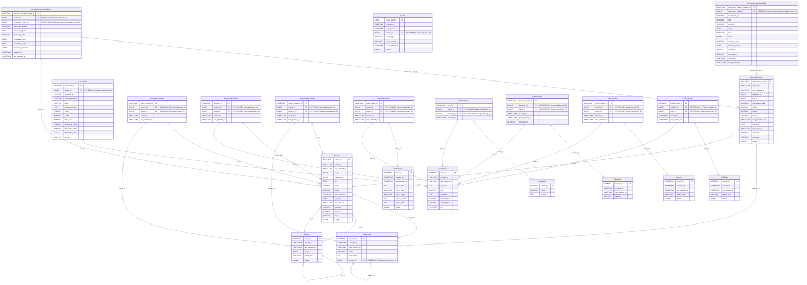

# TheCROWler DB architecture

The CROWler uses a PostgreSQL database to store the data it collects. However
it's internal data API is designed to be database agnostic, so it could be
easily adapted to use other databases in the future.

## InformationSeed claiming semantics

For the full status lifecycle, finalization rules, and rerun idempotency contract, see [Information seed lifecycle](information_seed_lifecycle.md).

`ClaimInformationSeeds` is implemented in the database package with explicit
DBMS-specific branches selected by `Handler.DBMS()`. All branches skip rows where
`disabled = true`, claim seeds in `new` or `pending`, reclaim stale `processing`
seeds only when `last_processed_at` is older than the configured
`processingTimeout`, and retry `error` seeds only when `last_error_at` is older
than the configured `retryAfter`.

DBMS-specific behavior and limitations:

- **PostgreSQL** uses a single transactional `UPDATE ... FROM (SELECT ... FOR
  UPDATE SKIP LOCKED LIMIT ...) RETURNING ...` claim. Concurrent claimers skip
  locked eligible rows and receive only the rows they atomically changed.
- **MySQL** uses the project-supported MySQL 8 style `SELECT ... FOR UPDATE SKIP
  LOCKED` inside a transaction, followed by a guarded `UPDATE` of the locked
  primary keys and a select of rows assigned to the claiming `engine`. This
  requires InnoDB row locks and MySQL versions that support `SKIP LOCKED`; older
  MySQL versions may block on locked rows or require a different guarded-update
  fallback.
- **SQLite** uses a transaction-safe bounded `UPDATE InformationSeed ... WHERE
  information_seed_id IN (SELECT ... LIMIT ...)` pattern, then selects rows
  assigned to the same `engine` and exact claim timestamp. SQLite does not
  provide row-level `SKIP LOCKED`, so concurrent writers are serialized by
  SQLite's database/page-level write locking rather than skipping locked rows.

## Source and information seed provenance

`Sources.config` stores the crawler configuration for a source itself: rulesets,
execution-plan settings, crawling restrictions, and other behavior that should
travel with the source no matter how many seeds discover it. It should not be
used for seed-specific discovery evidence because a single source can be
associated with many information seeds.

`SourceInformationSeedIndex` stores provenance that is specific to one
`(source_id, information_seed_id)` relationship. The unique pair remains the
identity of the relationship, while optional discovery columns record metadata
from the discovery pass that connected that source to that seed:

- `discovery_provider`: search engine, API, plugin, model, or other provider
  that returned the candidate.
- `discovery_query`: query, dork, prompt, or request used to produce the
  candidate.
- `discovery_rank`: provider rank or result position.
- `candidate_score`: normalized pre-crawl score assigned to the candidate.
- `candidate_reason`: concise explanation for why the candidate matched.
- `discovery_metadata`: JSON/JSONB object for provider-specific fields such as
  snippets, raw result IDs, query parameters, or scoring features.

`LinkSourceToInformationSeed` is intentionally idempotent and only creates the
relationship if it is missing. Callers that have discovery evidence should use
the richer metadata link helper, which upserts only the matching
`(source_id, information_seed_id)` row and leaves omitted metadata fields
unchanged. This keeps provenance for other seeds separate even when the same
source URL is discovered by multiple seeds.

`InformationSeedCandidate` stores the durable decision evidence for every
candidate considered by an information-seed run, including accepted and rejected
candidates. This is a deliberate product decision: rejected candidates are
persisted for auditability, debugging, and provider/plugin policy review, but
they are not promoted into `Sources` and therefore never enter the crawl
frontier. Accepted rows in `InformationSeedCandidate` record the per-run
decision evidence, while `SourceInformationSeedIndex` remains the accepted-source
provenance table for the actual source/seed relationship.

`InformationSeedCandidate` rows include the seed ID, normalized URL, host,
provider, query, rank, score, `accepted`/`rejected` decision status, rejection
reason, provider/plugin metadata, run attempt number, and timestamps. Listing is
provided by database helpers with seed-scoped pagination; no public API endpoint
is exposed yet, so console/API seed listing continues to report accepted source
counts only.

Here below is a diagram of the database architecture:

```mermaid
erDiagram
    InformationSeed {
        BIGSERIAL information_seed_id PK
        TIMESTAMP created_at
        TIMESTAMP last_updated_at
        BIGINT category_id
        BIGINT usr_id
        VARCHAR information_seed
        VARCHAR status
        VARCHAR priority
        VARCHAR engine
        TIMESTAMP last_processed_at
        TEXT last_error
        TIMESTAMP last_error_at
        BOOLEAN disabled
        INTEGER attempts
        JSONB config
    }

    InformationSeedCandidate {
        BIGSERIAL information_seed_candidate_id PK
        BIGINT information_seed_id FK "REFERENCES InformationSeed(information_seed_id)"
        VARCHAR normalized_url
        VARCHAR host
        VARCHAR provider
        TEXT query
        INTEGER rank
        FLOAT score
        VARCHAR decision_status
        TEXT rejection_reason
        JSONB metadata
        INTEGER run_attempt
        TIMESTAMP created_at
        TIMESTAMP last_updated_at
    }

    Sources {
        BIGSERIAL source_id PK
        TIMESTAMP created_at
        TIMESTAMP last_updated_at
        BIGINT usr_id
        BIGINT category_id
        TEXT url
        VARCHAR status
        VARCHAR engine
        TIMESTAMP last_crawled_at
        TEXT last_error
        TIMESTAMP last_error_at
        INTEGER restricted
        BOOLEAN disabled
        INTEGER flags
        JSONB config
    }

    Owners {
        BIGSERIAL owner_id PK
        TIMESTAMP created_at
        TIMESTAMP last_updated_at
        BIGINT usr_id
        VARCHAR details_hash
        JSONB details
    }

    SearchIndex {
        BIGSERIAL index_id PK
        TIMESTAMP created_at
        TIMESTAMP last_updated_at
        TEXT page_url
        VARCHAR title
        TEXT summary
        VARCHAR detected_type
        VARCHAR detected_lang
        TSVECTOR tsv
    }

    Categories {
        BIGSERIAL category_id PK
        TIMESTAMP created_at
        TIMESTAMP last_updated_at
        VARCHAR name
        TEXT description
        BIGINT parent_id FK "REFERENCES Categories(category_id)"
    }

    NetInfo {
        BIGSERIAL netinfo_id PK
        TIMESTAMP created_at
        TIMESTAMP last_updated_at
        VARCHAR details_hash
        JSONB details
    }

    HTTPInfo {
        BIGSERIAL httpinfo_id PK
        TIMESTAMP created_at
        TIMESTAMP last_updated_at
        VARCHAR details_hash
        JSONB details
    }

    Screenshots {
        BIGSERIAL screenshot_id PK
        BIGINT index_id FK "REFERENCES SearchIndex(index_id)"
        TIMESTAMP created_at
        TIMESTAMP last_updated_at
        VARCHAR type
        TEXT screenshot_link
        INTEGER height
        INTEGER width
        INTEGER byte_size
        INTEGER thumbnail_height
        INTEGER thumbnail_width
        TEXT thumbnail_link
        VARCHAR format
    }

    WebObjects {
        BIGSERIAL object_id PK
        TIMESTAMP created_at
        TIMESTAMP last_updated_at
        TEXT object_link
        VARCHAR object_type
        VARCHAR object_hash
        TEXT object_content
        TEXT object_html
        JSONB details
    }

    MetaTags {
        BIGSERIAL metatag_id PK
        VARCHAR name
        TEXT content
    }

    Keywords {
        BIGSERIAL keyword_id PK
        TIMESTAMP created_at
        TIMESTAMP last_updated_at
        VARCHAR keyword
    }

    Events {
        CHAR event_sha256 PK
        TIMESTAMP created_at
        TIMESTAMP last_updated_at
        BIGINT source_id FK "REFERENCES Sources(source_id)"
        VARCHAR event_type
        VARCHAR event_severity
        TIMESTAMP event_timestamp
        JSONB details
    }

    SourceInformationSeedIndex {
        BIGSERIAL source_information_seed_id PK
        BIGINT source_id FK "REFERENCES Sources(source_id)"
        BIGINT information_seed_id FK "REFERENCES InformationSeed(information_seed_id)"
        VARCHAR discovery_provider
        TEXT discovery_query
        INTEGER discovery_rank
        FLOAT candidate_score
        TEXT candidate_reason
        JSONB discovery_metadata
        TIMESTAMP created_at
        TIMESTAMP last_updated_at
    }

    SourceOwnerIndex {
        BIGSERIAL source_owner_id PK
        BIGINT source_id FK "REFERENCES Sources(source_id)"
        BIGINT owner_id FK "REFERENCES Owners(owner_id)"
        TIMESTAMP created_at
        TIMESTAMP last_updated_at
    }

    SourceSearchIndex {
        BIGSERIAL ss_index_id PK
        BIGINT source_id FK "REFERENCES Sources(source_id)"
        BIGINT index_id FK "REFERENCES SearchIndex(index_id)"
        TIMESTAMP created_at
        TIMESTAMP last_updated_at
    }

    SourceCategoryIndex {
        BIGSERIAL source_category_id PK
        BIGINT source_id FK "REFERENCES Sources(source_id)"
        BIGINT category_id FK "REFERENCES Categories(category_id)"
        TIMESTAMP created_at
        TIMESTAMP last_updated_at
    }

    WebObjectsIndex {
        BIGSERIAL page_object_id PK
        BIGINT index_id FK "REFERENCES SearchIndex(index_id)"
        BIGINT object_id FK "REFERENCES WebObjects(object_id)"
        TIMESTAMP created_at
        TIMESTAMP last_updated_at
    }

    MetaTagsIndex {
        BIGSERIAL sim_id PK
        BIGINT index_id FK "REFERENCES SearchIndex(index_id)"
        BIGINT metatag_id FK "REFERENCES MetaTags(metatag_id)"
        TIMESTAMP created_at
    }

    KeywordIndex {
        BIGSERIAL keyword_index_id PK
        BIGINT keyword_id FK "REFERENCES Keywords(keyword_id)"
        BIGINT index_id FK "REFERENCES SearchIndex(index_id)"
        TIMESTAMP created_at
        TIMESTAMP last_updated_at
        INTEGER occurrences
    }

    NetInfoIndex {
        BIGSERIAL netinfo_index_id PK
        BIGINT netinfo_id FK "REFERENCES NetInfo(netinfo_id)"
        BIGINT index_id FK "REFERENCES SearchIndex(index_id)"
        TIMESTAMP created_at
        TIMESTAMP last_updated_at
    }

    HTTPInfoIndex {
        BIGSERIAL httpinfo_index_id PK
        BIGINT httpinfo_id FK "REFERENCES HTTPInfo(httpinfo_id)"
        BIGINT index_id FK "REFERENCES SearchIndex(index_id)"
        TIMESTAMP created_at
        TIMESTAMP last_updated_at
    }

    Categories ||--|{ Categories : "parent_id"
    InformationSeed ||--o{ Categories : "category_id"
    InformationSeed ||--o{ Sources : "usr_id"
    InformationSeedCandidate ||--|{ InformationSeed : "information_seed_id"
    Sources ||--o{ Categories : "category_id"
    Sources ||--o{ Owners : "usr_id"
    Owners ||--o{ Sources : "usr_id"
    Owners ||--o{ Owners : "usr_id"
    SourceInformationSeedIndex ||--|{ InformationSeed : "information_seed_id"
    SourceInformationSeedIndex ||--|{ Sources : "source_id"
    SourceOwnerIndex ||--|{ Sources : "source_id"
    SourceOwnerIndex ||--|{ Owners : "owner_id"
    SourceSearchIndex ||--|{ Sources : "source_id"
    SourceSearchIndex ||--|{ SearchIndex : "index_id"
    SourceCategoryIndex ||--|{ Sources : "source_id"
    SourceCategoryIndex ||--|{ Categories : "category_id"
    WebObjectsIndex ||--|{ WebObjects : "object_id"
    WebObjectsIndex ||--|{ SearchIndex : "index_id"
    MetaTagsIndex ||--|{ MetaTags : "metatag_id"
    MetaTagsIndex ||--|{ SearchIndex : "index_id"
    KeywordIndex ||--|{ Keywords : "keyword_id"
    KeywordIndex ||--|{ SearchIndex : "index_id"
    NetInfoIndex ||--|{ NetInfo : "netinfo_id"
    NetInfoIndex ||--|{ SearchIndex : "index_id"
    HTTPInfoIndex ||--|{ HTTPInfo : "httpinfo_id"
    HTTPInfoIndex ||--|{ SearchIndex : "index_id"
    Screenshots ||--|{ SearchIndex : "index_id"
```
