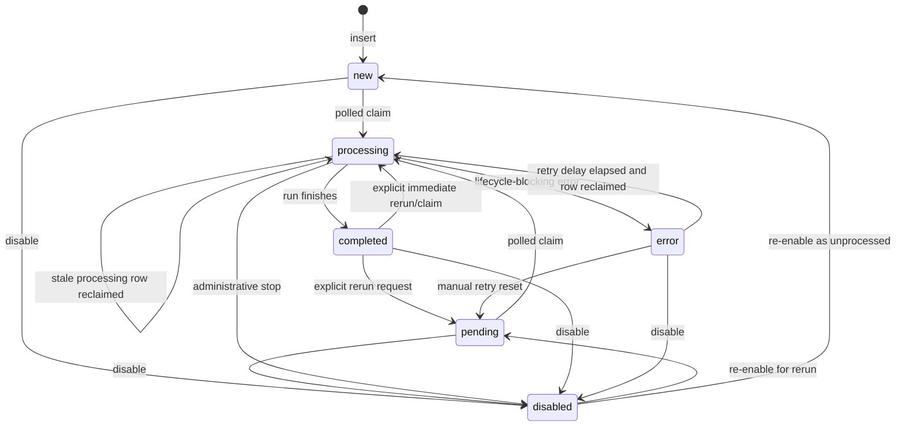

# Information seed lifecycle

This document defines the lifecycle contract for rows in `InformationSeed` and
how discovery workers turn an information seed into linked `Sources` rows.
Workers claim work by polling the database; there are no database triggers,
notifications, or listeners that enqueue an inserted seed for processing.

## Status values

`InformationSeed.status` is a lower-case lifecycle state. The valid statuses are:

| Status | Meaning |
| --- | --- |
| `new` | A seed has been created and has not yet been claimed by a discovery worker. This is the default insertion state. |
| `pending` | A seed is intentionally queued for discovery or re-discovery, but has not yet been claimed. Use this when a caller wants to request a rerun without implying the row has never been processed. |
| `processing` | A worker has claimed the seed and is currently collecting candidates, validating them, and linking accepted sources. |
| `completed` | Processing finished without a lifecycle-blocking error. This includes successful discovery, no-op reruns, and exhausted searches that produce no accepted links. |
| `error` | Processing ended with a lifecycle-blocking provider or plugin/runtime error and should be retried only after the configured retry delay. |
| `disabled` | The seed is administratively inactive. Disabled seeds are not eligible for normal polling claims. |

A row may also have the boolean `disabled` flag. A row with `disabled = true`
must be treated as disabled even if `status` contains another value. Setting
`status = 'disabled'` is useful for human-readable state, while `disabled = true`
is the authoritative claim exclusion used by workers.

## Allowed transitions

Workers and API handlers should keep status changes within the following state
machine:



Additional rules:

- `new` and `pending` are always eligible to be claimed when `disabled = false`.
- `processing` is eligible only when it is stale: `last_processed_at` is `NULL` or
  older than the configured `processingTimeout`.
- `error` is eligible only when `last_error_at` is `NULL` or older than the
  configured retry delay.
- `completed` is terminal for automatic polling. It should move back to
  `pending` only because of an explicit rerun request or to `processing` only by
  an immediate manual claim/update path.
- `disabled` is terminal for automatic polling until the row is re-enabled and
  moved to `pending` or `new`.

## Timestamp semantics

| Column | Set when | Meaning |
| --- | --- | --- |
| `last_processed_at` | On every successful claim into `processing`; optionally updated again when the worker writes the final status. | The most recent time a worker began processing this seed. It is the stale-processing clock used to reclaim abandoned `processing` rows. It should not be used as proof that discovery completed successfully. |
| `last_error_at` | When a lifecycle-blocking provider, plugin validation, plugin timeout, or persistence error causes final status `error`. | The retry-backoff clock for `error` seeds. It should remain unchanged on successful reruns and on non-blocking partial failures that still complete. |
| `last_updated_at` | On any update to the seed row, either by DB-managed update timestamp behavior or by the application update statement. | The general audit timestamp for row mutation. It is not the claim, retry, or stale-processing clock. |

When a worker changes final status to `completed`, it should clear `last_error`
only if the previous error is no longer relevant to the current run. When a
worker changes final status to `error`, it must set both `last_error` and
`last_error_at`.

## Processing metadata fields

- `attempts` counts claim attempts, not only failed attempts. It is incremented
  when a row is claimed as `processing`, including initial runs, retries of
  `error` rows, and stale `processing` reclaims. It provides operational history
  and can be used by workers or operators to apply maximum-attempt policies.
- `engine` stores the identifier of the worker that most recently claimed the
  row. This is used for observability and to select rows claimed in a DBMS branch
  that cannot return changed rows directly. It should be overwritten on each new
  claim.
- `last_error` stores a concise, human-readable description of the latest
  lifecycle-blocking error. It should include enough context to distinguish
  provider failure, plugin rejection/timeout, validation error, or persistence
  failure, but should avoid unbounded logs or secrets.
- `priority` is a caller-defined scheduling hint. The current claim contract is
  FIFO by `created_at` and `information_seed_id`; priority is retained for APIs,
  operator filtering, and future scheduler policies. Workers that implement
  priority-aware polling must preserve the same idempotency and retry rules.

## End-to-end discovery contract

An enabled seed reaches a terminal lifecycle state through the same deterministic
phase order on every run:

1. A caller inserts an `InformationSeed` row with `status = 'new'` or
   `status = 'pending'`, `disabled = false`, and optional JSON in
   `InformationSeed.config`.
2. API and database package creation helpers wake the in-process scheduler for
   enabled `new` or `pending` seeds. PostgreSQL deployments also emit a
   `LISTEN/NOTIFY` message on `information_seed_created` so other processes can
   wake promptly.
3. The scheduler coalesces duplicate wake-ups and still polls on every
   `information_seed.query_timer` interval, so missed notifications, unsupported
   database backends, and process restarts recover through the normal polling
   path.
4. The claim helper atomically moves eligible rows to `processing`, records the
   claiming engine, increments `attempts`, and stamps `last_processed_at`.
5. The runner parses and validates `InformationSeed.config` into the per-run
   contract shown below.
6. Candidate processing always uses this canonical order: URL normalization and
   URL/host de-duplication, built-in filters, user candidate plugins, source
   override validation, then persistence/linking. Built-in filters enforce
   allowed domains, denied domains, required URL schemes, minimum score, maximum
   candidates per host/domain, and the seed/global candidate limit before any
   user plugin can run.
7. Source persistence applies the seed source policy before linking. New sources
   are created only when `create_sources` is `true`; existing sources are linked
   only when `link_existing_sources` is `true`; and existing source configs are
   refreshed only when `update_existing_source_config` is `true`. Linking uses
   the unique source/seed pair and is idempotent across reruns.
8. Custom candidate plugin phases run only after built-in provider discovery,
   URL normalization/de-duplication, and built-in filters. `candidate_plugins`
   is both the ordered execution list and the allow-list: when omitted, all
   registered candidate processors run in registration order; when present, only
   matching named processors run, in the seed-provided order, with duplicate or
   unknown names ignored. Plugins may reject candidates or apply the documented
   safe source overrides, but plugin output and source overrides are validated
   before any decision or override is applied. Plugins do not replace built-in
   source persistence, source/seed linking, lifecycle finalization, or event
   emission phases.
9. The runner writes `completed`, `error`, or `disabled` as the terminal status
   for the current attempt according to the final-status table.

## `InformationSeed.config` example

`InformationSeed.config` is seed-specific JSON. It selects from providers that
are already present in the global `information_seed.providers` map and allowed
by `information_seed.provider_allow_list`; it does not define provider
credentials. Free/public discovery options such as `rss_feed` and
`common_crawl_index` should appear before paid/API-key integrations in operator
configuration so seed runs prefer lower-friction sources. API-based providers
(for example Brave Search, Bing Web Search, Google CSE, Shodan, or a custom
`http_json` gateway with credentials) must be clearly labelled as paid,
commercial, or API-key integrations in shared examples and deployment runbooks.

The `browser_search` HTML adapter is disabled unless it is explicitly configured
and allow-listed. Use it only for local fixtures or after reviewing the target
site's robots.txt, terms of service, consent flow, anti-abuse policy, and
rate-limit expectations. Scraping public search result pages can create legal,
contractual, privacy, and service-reliability risk; prefer official APIs when a
provider offers them, identify your crawler with an appropriate User-Agent where
allowed, do not bypass consent or access controls, do not send credentials to
HTML search pages, and keep deterministic fixtures in tests instead of hitting
live search engines. Always configure explicit provider limits such as
`rate_limit`, `max_requests`, `max_pages`, `page_size`, and `timeout`; use
conservative values such as `rate_limit: 30s`, `max_requests: 1`, and
`max_pages: 1` for public HTML search pages until the site owner or applicable
policy permits more. Its CSS selectors are site-specific, credentials are
stripped rather than sent, and strict page/request/timeout/debug-output caps
apply. All fields are optional, but this example shows the complete production
contract for the current runner:

```json
{
  "query_templates": [
    "{{ .Seed }} official site",
    "{{ .Seed }} research portal",
    "{{ .Seed }} annual report"
  ],
  "providers": ["public_json", "partner_search"],
  "tracking_params": ["utm_source", "utm_medium", "utm_campaign"],
  "deduplicate_host": true,
  "max_candidates": 25,
  "allowed_domains": ["example.invalid"],
  "denied_domains": ["ads.example.invalid"],
  "required_url_schemes": ["https"],
  "min_score": 0.2,
  "max_candidates_per_host": 3,
  "max_candidates_per_domain": 10,
  "source_name_template": "{{ .Seed }} — {{ .Candidate.Title }}",
  "source_priority": "normal",
  "create_sources": true,
  "link_existing_sources": true,
  "update_existing_source_config": true,
  "disabled": false,
  "status": "new",
  "restricted": 1,
  "flags": 0,
  "source_config": {
    "version": "1.0",
    "format_version": "1.0",
    "source_name": "information-seed-default",
    "crawling_config": {
      "site": "https://example.invalid/placeholder",
      "source_type": "website"
    },
    "custom": {
      "created_by": "information_seed"
    }
  },
  "candidate_plugins": ["domain-policy", "source-overrides"]
}
```

Configuration behavior:

- `query_templates` are rendered with the seed text and produce provider query
  strings. Literal `queries` may also be supplied; rendered and literal queries
  are bounded by `information_seed.max_queries_per_seed`.
- `providers` is an ordered selection of global provider names for this seed. If
  omitted, the runner uses the global provider allow-list order.
- `tracking_params` are removed during URL normalization before de-duplication
  and source lookup.
- `deduplicate_host` keeps at most one normalized candidate per host; otherwise
  duplicate filtering is by normalized URL.
- `max_candidates` is capped by `information_seed.max_candidates_per_seed` and is
  enforced during the built-in filter phase.
- `allowed_domains` keeps only candidates whose host is the listed domain or a
  subdomain. `denied_domains` rejects listed domains/subdomains after the allow
  check and before scoring or cardinality limits.
- `required_url_schemes` rejects candidates whose normalized URL scheme is not in
  the list. Normalization already limits candidates to HTTP(S), so this is most
  often used to require `https`.
- `min_score` rejects candidates below the configured score.
- `max_candidates_per_host` and `max_candidates_per_domain` keep the first N
  candidates in deterministic candidate order for each host or registrable
  domain.
- `source_name_template`, `source_priority`, `restricted`, `flags`, `disabled`,
  `status`, and `source_config` provide defaults for accepted candidates that
  become new `Sources` rows. Candidate plugins may override only the safe subset
  documented in the plugin contract.
- `create_sources` defaults to `true`. Set it to `false` to make the run
  discovery/link-only: candidates with URLs that are not already present in
  `Sources` are skipped instead of inserted.
- `link_existing_sources` defaults to `true`. Set it to `false` when an
  accepted candidate may create a missing source but must not attach an already
  existing source to the seed. Source/seed linking remains idempotent under both
  settings.
- `update_existing_source_config` defaults to `true` to preserve the previous
  behavior for non-empty `source_config` updates on existing, non-processing
  sources. Set it to `false` to prevent seed-level or plugin-provided
  `source_config` from changing an existing source. Existing source identity,
  ownership, priority, restriction, flags, disabled state, and status are not
  overwritten by information-seed discovery.
- Seed-level and plugin-provided `source_config` values are validated against the
  same source configuration requirements before they are persisted. Invalid
  configs fail the persistence phase rather than creating or updating a source.
- `candidate_plugins` is both a seed-level ordered execution list and an
  allow-list. When omitted, all registered information-seed candidate processors
  are eligible in registration order. When present, only named processors
  matching the list are selected, they run in the list order, and duplicate or
  unknown names are ignored.

## Production enablement example: Tyrell Corporation

The following complete example shows how an operator can enable a production
seed with bounded provider usage, deterministic query rendering, plugin
selection, expected source defaults, and provenance inspection. It uses only
placeholder credentials and example domains.

### Global provider configuration

Add the providers to `config.yaml` and allow only the provider names intended for
production. List free/public providers first and keep paid/API-key integrations
clearly labelled. The request limits shown below keep the run bounded: at most
three rendered queries per seed, one provider page per query, ten results per
page, and no more than twenty accepted candidates.

```yaml
information_seed:
  enabled: true
  query_timer: 300
  max_concurrent_seeds: 2
  max_queries_per_seed: 3
  max_candidates_per_seed: 20
  retry_interval: 300
  processing_timeout: 30 minutes
  provider_allow_list:
    - rss_public_news
    - common_crawl_latest
    - public_json
    # Paid/API-key provider; enable only with a valid subscription.
    # - brave_search_api
  providers:
    rss_public_news:
      provider: rss_feed
      host: https://www.cisa.gov
      endpoint: /news.xml
      timeout: 10
      rate_limit: 30s
      max_requests: 1
      page_size: 10
      max_pages: 1
    common_crawl_latest:
      provider: common_crawl_index
      host: https://index.commoncrawl.org
      endpoint: /CC-MAIN-2026-18-index
      parameters:
        output: json
        filter: status:200
        collapse: urlkey
      timeout: 15
      rate_limit: 10s
      max_requests: 1
      page_size: 10
      max_pages: 1
    public_json:
      provider: http_json
      host: https://search-adapter.example.invalid
      endpoint: /v1/search
      parameters:
        safe_search: strict
        locale: en-US
      timeout: 30
      rate_limit: "1"
      max_requests: 3
      page_size: 10
      max_pages: 1
    # Paid/API-key provider.
    brave_search_api:
      provider: brave_search
      host: https://api.search.brave.com
      endpoint: /res/v1/web/search
      api_key: ${INFORMATION_SEED_BRAVE_SEARCH_API_KEY}
      timeout: 30
      rate_limit: "1"
      max_requests: 3
      page_size: 10
      max_pages: 1
  plugin_limits:
    timeout: 30
    max_output_size_bytes: 1048576
```

### API request body

Submit the seed with `POST /v1/information_seed/add`. The seed-level `config`
selects the already-configured providers, renders three queries, limits accepted
candidates, and chooses the candidate plugins that may run. The source defaults
are safe for accepted sources: created sources are enabled, set to `new`, use a
restricted crawl scope, and carry a source config that can pass normal source
configuration validation.

```json
{
  "information_seed": "Tyrell Corporation",
  "category_id": 42,
  "usr_id": 7,
  "priority": 10,
  "status": "new",
  "disabled": false,
  "config": {
    "query_templates": [
      "{{ .Seed }} official website",
      "{{ .Seed }} investor relations",
      "{{ .Seed }} contact support"
    ],
    "providers": ["rss_public_news", "common_crawl_latest", "public_json"],
    "tracking_params": ["utm_source", "utm_medium", "utm_campaign", "fbclid"],
    "deduplicate_host": true,
    "max_candidates": 10,
    "required_url_schemes": ["https"],
    "min_score": 0.2,
    "max_candidates_per_host": 1,
    "max_candidates_per_domain": 3,
    "source_name_template": "{{ .Seed }} — {{ .Candidate.Title }}",
    "source_priority": "normal",
    "create_sources": true,
    "link_existing_sources": true,
    "update_existing_source_config": false,
    "disabled": false,
    "status": "new",
    "restricted": 1,
    "flags": 0,
    "source_config": {
      "version": "1.0",
      "format_version": "1.0",
      "source_name": "tyrell-information-seed",
      "crawling_config": {
        "site": "https://www.tyrell.example/",
        "source_type": "website"
      },
      "custom": {
        "created_by": "information_seed",
        "seed_label": "tyrell-corporation"
      }
    },
    "candidate_plugins": ["domain-policy", "source-overrides"]
  }
}
```

### Rendered queries and provider selection

For a seed created with the text `Tyrell Corporation`, the query templates render
as follows. Rendering happens before provider execution, empty or duplicate
queries are removed, and the resulting list is capped by
`information_seed.max_queries_per_seed`.

```text
Tyrell Corporation official website
Tyrell Corporation investor relations
Tyrell Corporation contact support
```

The run selects providers in the seed-level order: `rss_public_news`,
`common_crawl_latest`, then `public_json`. All names must also exist in the
global `providers` map and in `provider_allow_list`; otherwise the runner skips
the missing or disallowed name. With the limits above, each provider receives at
most its configured request budget, one page per request, and ten results per
page.

### Candidate plugins

The `candidate_plugins` list is both the ordered execution plan and the
allow-list for registered information-seed candidate processors. In this example
only `domain-policy` and `source-overrides` are eligible. If the processors are
not registered in the running engine, they are ignored; if they reject
candidates without a lifecycle-blocking runtime error, the seed can still finish
as `completed` with rejection evidence.

### Expected source configuration

An accepted Tyrell candidate that does not already exist in `Sources` is created
with source defaults equivalent to the following values, subject to candidate
plugin safe overrides:

```json
{
  "name": "Tyrell Corporation — <candidate title>",
  "priority": "normal",
  "category_id": 42,
  "usr_id": 7,
  "restricted": 1,
  "flags": 0,
  "disabled": false,
  "status": "new",
  "config": {
    "version": "1.0",
    "format_version": "1.0",
    "source_name": "tyrell-information-seed",
    "crawling_config": {
      "site": "https://www.tyrell.example/",
      "source_type": "website"
    },
    "custom": {
      "created_by": "information_seed",
      "seed_label": "tyrell-corporation"
    }
  }
}
```

Because `update_existing_source_config` is `false`, an already-existing source
can be linked to the seed without having its existing `Sources.config` replaced
by the seed default.

### Provenance inspection

After the worker processes the seed, inspect status, linked sources, and
candidate decision evidence. Replace `123` with the `information_seed_id` from
the add response.

```bash
curl -sS 'http://localhost:8080/v1/information_seed/status?information_seed_id=123'
curl -sS 'http://localhost:8080/v1/information_seed/sources?information_seed_id=123&limit=50&offset=0'
curl -sS 'http://localhost:8080/v1/information_seed/candidates?information_seed_id=123&limit=100&offset=0'
```

Linked source responses include `source_information_seed_index`, where operators
can inspect `discovery_provider`, `discovery_query`, `discovery_rank`,
`candidate_score`, `candidate_reason`, `discovery_metadata`, and link
timestamps. Candidate responses expose accepted and rejected decision rows,
including provider, query, rank, score, rejection reason, metadata, and run
attempt, so operators can explain why a Tyrell URL became a source or why it was
filtered.

## Operator commands

Use the following API commands from a shell with access to the API service.

Add a seed:

```bash
curl -sS -X POST 'http://localhost:8080/v1/information_seed/add' \
  -H 'Content-Type: application/json' \
  -d @tyrell-information-seed.json
```

Check seed status:

```bash
curl -sS 'http://localhost:8080/v1/information_seed/status?information_seed_id=123'
```

List sources linked to a seed:

```bash
curl -sS 'http://localhost:8080/v1/information_seed/sources?information_seed_id=123&limit=50&offset=0'
```

List candidate decisions, when candidate evidence persistence is available:

```bash
curl -sS 'http://localhost:8080/v1/information_seed/candidates?information_seed_id=123&limit=100&offset=0'
```

Queue a retry after correcting configuration or credentials:

```bash
curl -sS -X POST 'http://localhost:8080/v1/information_seed/retry' \
  -H 'Content-Type: application/json' \
  -d '{"information_seed_id":123}'
```

Disable a seed so it is no longer claimed by workers:

```bash
curl -sS -X POST 'http://localhost:8080/v1/information_seed/disable' \
  -H 'Content-Type: application/json' \
  -d '{"information_seed_id":123}'
```

## Troubleshooting production seed runs

| Symptom | Likely cause | Remediation |
| --- | --- | --- |
| Providers are missing or never run. | The provider is disabled, absent, disallowed, misspelled, or not loaded by the worker. | Enable `information_seed`, add and allow-list the provider, restart/reload workers, then retry. |
| Credentials are rejected. | Placeholder credentials, wrong credential fields, inactive subscriptions, or provider-specific auth requirements. | Use environment variables, verify adapter fields, test credentials externally, then retry after replacing secrets. |
| Rate limits or quota errors occur. | Provider quota is lower than configured concurrency, request rate, page count, or query volume. | Lower concurrency and request/page limits, slow `rate_limit`, increase `retry_interval`, then retry after reset. |
| Plugins reject all candidates. | Selected processors enforce stricter domain, score, or source override policy than expected. | Inspect candidate decisions, loosen filters or plugin policy, confirm plugin registration/order, then retry if needed. |
| Source config validation fails. | Seed-level or plugin-provided `source_config` is invalid for source creation/update. | Validate normal source config fields, start from the safe example, remove unsafe overrides, then retry. |
| Duplicate or existing sources appear in results. | A normalized URL or source/seed link already exists from a prior run. | Treat this as idempotent; inspect provenance and use `update_existing_source_config: false` when configs must not change. |
| The seed remains disabled or is never claimed. | `disabled` is true, status is terminal, or the global scheduler is disabled. | Re-enable the seed, use `/v1/information_seed/retry` when appropriate, and confirm global discovery is enabled. |


## Final status behavior

Discovery runs often involve multiple providers followed by plugin validation.
The final status is determined by whether the run completed its lifecycle and
whether any accepted source links remain after validation.

| Outcome | Final status | Timestamp/error behavior |
| --- | --- | --- |
| All providers succeed and accepted sources are created or already exist, with `SourceInformationSeedIndex` links present. | `completed` | `last_processed_at` reflects the claim/run. Clear stale `last_error` if appropriate; do not update `last_error_at`. |
| One or more providers fail, but at least one candidate from another provider is accepted and linked. | `completed` | Treat provider failures as non-blocking partial failures. Record details in discovery metadata or logs rather than `last_error`, unless policy requires surfacing the warning. |
| Providers return zero results. | `completed` | This is a successful no-result run. Do not set `last_error`/`last_error_at`. |
| Providers return candidates, but all candidates are rejected by plugins. | `completed` | This is a successful filtered run. Do not set `last_error`/`last_error_at`; persist per-candidate rejection evidence in `InformationSeedCandidate`. |
| Every provider fails before producing usable candidates. | `error` | Set `last_error` to the provider failure summary and set `last_error_at` to the finalization time. |
| A provider error prevents the worker from completing the discovery lifecycle, even if the provider set is not exhausted. | `error` | Set `last_error` and `last_error_at`. Retry is controlled by the `error` retry delay. |
| Plugin validation or plugin timeout rejects only some candidates and at least one accepted candidate is linked. | `completed` | Treat as partial validation failure. Keep the run completed and record validation details outside the lifecycle error fields. |
| Plugin validation or plugin timeout prevents all validation from completing, or policy requires plugin runtime errors to fail the whole run. | `error` | Set `last_error` with the plugin name/reason and set `last_error_at`. |
| Linking or source persistence fails for otherwise accepted candidates. | `error` | Set `last_error` and `last_error_at` because accepted work could not be made durable. |

## Candidate edge cases

| Edge case | Contract |
| --- | --- |
| Duplicate provider URLs after normalization. | Keep one candidate for the normalized URL and reject duplicate URLs before plugin processing. The final status remains governed by the remaining candidates. |
| Multiple URLs on the same host with `deduplicate_host = true`. | Keep one candidate for that host and reject later same-host candidates before plugin processing. |
| Existing `Sources.url` already matches an accepted normalized URL. | Reuse the existing `Sources` row and ensure the `SourceInformationSeedIndex` relationship exists. Do not create a duplicate source row. |
| Existing source/seed link already exists. | Treat the link as idempotent and update or preserve relationship discovery metadata according to database helper semantics. |
| A rerun discovers only already-linked sources. | Finish as `completed`; no new source rows are required for a successful rerun. |
| A rerun repairs missing source/seed links for existing sources. | Finish as `completed` after durable link repair. |
| A candidate plugin rejects every candidate without a lifecycle-blocking runtime error. | Finish as `completed` with rejection summaries rather than source rows. |
| A candidate plugin returns invalid source overrides or invalid `source_config`. | Treat the affected validation as plugin/persistence failure. If validation prevents durable completion, finish as `error`. |

In short: `completed` means the discovery lifecycle ran to a deterministic end,
not necessarily that new sources were found. `error` means the lifecycle could
not complete durably and automatic retry is appropriate.


## Discovery events

The seed runner emits operational events during each discovery run. Events that
belong to the seed as a whole use `source_id = 0` so they can be stored in the
existing `Events` table even when no `Sources` row exists yet. Events that refer
to a persisted candidate source use that source's `source_id`.

| Event type | Source ID | Meaning |
| --- | --- | --- |
| `information_seed.discovery_started` | `0` | The runner parsed the seed configuration, rendered queries, and began provider discovery. |
| `information_seed.candidate_found` | `0` | Provider discovery completed and the runner recorded the aggregate number of raw candidates found. |
| `information_seed.candidate_rejected` | `0` | One batched rejection event for the run when normalization, de-duplication, limits, or candidate processors reject candidates. Per-candidate rejection events are intentionally avoided to reduce noise. |
| `information_seed.source_created` | Created source ID | A candidate was persisted through `CreateSource`; the payload includes the current run counters and the source ID is stored in the event row. |
| `information_seed.discovery_completed` | `0` | Discovery reached a durable terminal `completed` status. This may include no-result runs and runs with non-blocking provider or processor warnings. |
| `information_seed.discovery_failed` | `0` | Discovery hit a lifecycle-blocking parse, query, provider, processor, persistence, or final status error and the seed is marked `error` when possible. |

Every information-seed event payload includes the same stable run diagnostics
contract (`schema_version = information_seed.run_diagnostics.v1`) so Agents,
operators, and plugins can subscribe to any individual phase without needing a
different schema per event. All events emitted during one claimed attempt share
`run_id`; `run_attempt` is the `InformationSeed.attempts` value from the claimed
row.

```json
{
  "schema_version": "information_seed.run_diagnostics.v1",
  "information_seed_id": 123,
  "information_seed": "renewable energy market signals",
  "run_id": "information-seed-123-attempt-4",
  "run_attempt": 4,
  "source_id": 0,
  "provider_counts": { "example_provider": 12 },
  "provider_metrics": { "example_provider": { "candidates": 12, "errors": 0 } },
  "provider_configs": {
    "example_provider": {
      "provider": "http_json",
      "host": "https://search.example/?api_key=REDACTED",
      "max_requests": 3,
      "max_pages": 1,
      "page_size": 10,
      "parameters": { "api_key": "REDACTED", "safe": "value" },
      "headers": { "Authorization": "REDACTED", "X-Trace": "trace" }
    }
  },
  "candidate_counts": {
    "found": 12,
    "accepted": 8,
    "rejected": 4,
    "by_stage": {
      "provider_discovery": 12,
      "normalization": 2,
      "built_in_filters": 1,
      "user_candidate_plugins": 1,
      "source_override_validation": 0,
      "source_persistence": 8
    }
  },
  "candidates_found": 12,
  "candidates_accepted": 8,
  "candidates_rejected": 4,
  "candidate_rejection_counts": {
    "duplicate_url": 2,
    "candidate_limit": 1,
    "candidate_processor": 1
  },
  "candidate_rejection_stages": {
    "normalization": { "duplicate_url": 2 },
    "built_in_filters": { "candidate_limit": 1 },
    "user_candidate_plugins": { "candidate_processor": 1 }
  },
  "sources_created": 8,
  "sources_linked": 8,
  "source_ids_created": [501, 502],
  "source_ids_linked": [501, 502, 503],
  "error_summaries": [],
  "plugin_metadata": []
}
```

`candidate_rejection_stages` groups the same stable reason constants by the
phase that rejected them, including `normalization`, `built_in_filters`,
`user_candidate_plugins`, and `source_override_validation` when those phases
reject at least one candidate. The top-level `candidates_*` counters are retained
for compatibility; new consumers should prefer `candidate_counts` for stage
summaries.

Operators may inspect `provider_configs`, `plugin_metadata`, and
`error_summaries` for diagnostics, but these fields are redacted before storage.
Provider API keys/tokens, configured headers such as `Authorization`, sensitive
query parameters, plugin metadata keys containing words such as `secret`,
`token`, `password`, or `credential`, and matching error fragments are replaced
with `REDACTED`. Provider, plugin, or database errors should remain concise
summaries rather than unbounded logs in `Events.details`.

## Idempotency and reruns

Information seed processing must be safe to rerun after manual resets, stale
claim recovery, process crashes, and retry of `error` rows.

- `Sources.url` must not duplicate. Workers must normalize candidate URLs before
  lookup/insert and must use existing `Sources` rows for URLs that are already
  present.
- If a source already exists but the `(source_id, information_seed_id)`
  relationship is missing, the rerun must add the missing
  `SourceInformationSeedIndex` link.
- Link creation is idempotent. Duplicate source/seed pairs must be ignored or
  upserted without creating extra rows.
- Discovery metadata belongs on `SourceInformationSeedIndex`, not on
  `Sources.config`, because the same source may be discovered by multiple seeds.
  Reruns may merge or fill missing relationship metadata without clearing fields
  that were supplied by previous runs.
- Candidate decision evidence belongs on `InformationSeedCandidate`. The runner
  persists both accepted and rejected decisions with the seed ID, normalized URL,
  host, provider, query, rank, score, decision status, rejection reason,
  provider/plugin metadata, and run attempt. Rejected candidates must not create
  `Sources` rows; only accepted candidates proceed to source creation/linking.
- A rerun that discovers only existing sources and repairs missing links should
  still finish as `completed`.
- A rerun that has no new candidates and no missing links to repair should also
  finish as `completed`.

## Creation notifications and polling fallback

Use exported database helpers such as `CreateInformationSeedAndNotify` for
application seed creation. They insert the row inside `pkg/database` and, when
the new row is enabled and immediately claimable (`status = 'new'` or
`status = 'pending'`), trigger scheduler wake-up behavior:

1. Every supported database wakes registered in-process schedulers through a
   coalesced channel. Multiple creation events that arrive while a scheduler is
   already awake collapse into one immediate claim cycle.
2. PostgreSQL additionally sends `pg_notify('information_seed_created', seed_id)`.
   Other CROWler processes that are listening on that channel wake without
   waiting for their next polling tick.
3. SQLite and MySQL rely on the in-process wake-up when the creator and
   scheduler share a process. When no local scheduler is registered, or a wake-up
   is missed, periodic polling remains the recovery mechanism.

Direct insertion into `InformationSeed` is still supported for integrations that
cannot call the helper, as long as the row uses a valid status, normally `new` or
`pending`, and `disabled = false`. Direct inserts do not emit the helper
notification, so they are discovered by the normal polling claim path:

1. A worker periodically calls the claim operation with a batch limit, engine
   identifier, `processingTimeout`, and retry delay.
2. The claim operation atomically changes eligible rows to `processing`, stamps
   `engine`, stamps `last_processed_at`, and increments `attempts`.
3. The worker processes claimed seeds and writes final `completed` or `error`
   state.

The scheduler always preserves stale processing recovery and retry delay
behavior because notifications only advance the next claim attempt; they do not
change the eligibility predicates used by `ClaimInformationSeeds`. Database
triggers may still exist for audit fields such as `last_updated_at`; those audit
triggers do not drive seed discovery.
