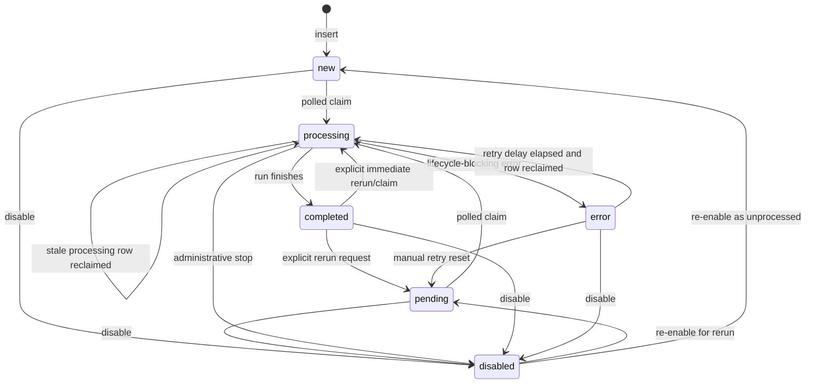

# Information seed lifecycle

This document defines the lifecycle contract for rows in `InformationSeed` and
how discovery workers turn an information seed into linked `Sources` rows.
Workers claim work by polling the database; there are no database triggers,
notifications, or listeners that enqueue an inserted seed for processing.

## Status values

`InformationSeed.status` is a lower-case lifecycle state. The valid statuses are:

| Status | Meaning |
| --- | --- |
| `new` | A seed has been created and has not yet been claimed by a discovery worker. This is the default insertion state. |
| `pending` | A seed is intentionally queued for discovery or re-discovery, but has not yet been claimed. Use this when a caller wants to request a rerun without implying the row has never been processed. |
| `processing` | A worker has claimed the seed and is currently collecting candidates, validating them, and linking accepted sources. |
| `completed` | Processing finished without a lifecycle-blocking error. This includes successful discovery, no-op reruns, and exhausted searches that produce no accepted links. |
| `error` | Processing ended with a lifecycle-blocking provider or plugin/runtime error and should be retried only after the configured retry delay. |
| `disabled` | The seed is administratively inactive. Disabled seeds are not eligible for normal polling claims. |

A row may also have the boolean `disabled` flag. A row with `disabled = true`
must be treated as disabled even if `status` contains another value. Setting
`status = 'disabled'` is useful for human-readable state, while `disabled = true`
is the authoritative claim exclusion used by workers.

## Allowed transitions

Workers and API handlers should keep status changes within the following state
machine:



Additional rules:

- `new` and `pending` are always eligible to be claimed when `disabled = false`.
- `processing` is eligible only when it is stale: `last_processed_at` is `NULL` or
  older than the configured `processingTimeout`.
- `error` is eligible only when `last_error_at` is `NULL` or older than the
  configured retry delay.
- `completed` is terminal for automatic polling. It should move back to
  `pending` only because of an explicit rerun request or to `processing` only by
  an immediate manual claim/update path.
- `disabled` is terminal for automatic polling until the row is re-enabled and
  moved to `pending` or `new`.

## Timestamp semantics

| Column | Set when | Meaning |
| --- | --- | --- |
| `last_processed_at` | On every successful claim into `processing`; optionally updated again when the worker writes the final status. | The most recent time a worker began processing this seed. It is the stale-processing clock used to reclaim abandoned `processing` rows. It should not be used as proof that discovery completed successfully. |
| `last_error_at` | When a lifecycle-blocking provider, plugin validation, plugin timeout, or persistence error causes final status `error`. | The retry-backoff clock for `error` seeds. It should remain unchanged on successful reruns and on non-blocking partial failures that still complete. |
| `last_updated_at` | On any update to the seed row, either by DB-managed update timestamp behavior or by the application update statement. | The general audit timestamp for row mutation. It is not the claim, retry, or stale-processing clock. |

When a worker changes final status to `completed`, it should clear `last_error`
only if the previous error is no longer relevant to the current run. When a
worker changes final status to `error`, it must set both `last_error` and
`last_error_at`.

## Processing metadata fields

- `attempts` counts claim attempts, not only failed attempts. It is incremented
  when a row is claimed as `processing`, including initial runs, retries of
  `error` rows, and stale `processing` reclaims. It provides operational history
  and can be used by workers or operators to apply maximum-attempt policies.
- `engine` stores the identifier of the worker that most recently claimed the
  row. This is used for observability and to select rows claimed in a DBMS branch
  that cannot return changed rows directly. It should be overwritten on each new
  claim.
- `last_error` stores a concise, human-readable description of the latest
  lifecycle-blocking error. It should include enough context to distinguish
  provider failure, plugin rejection/timeout, validation error, or persistence
  failure, but should avoid unbounded logs or secrets.
- `priority` is a caller-defined scheduling hint. The current claim contract is
  FIFO by `created_at` and `information_seed_id`; priority is retained for APIs,
  operator filtering, and future scheduler policies. Workers that implement
  priority-aware polling must preserve the same idempotency and retry rules.

## Final status behavior

Discovery runs often involve multiple providers followed by plugin validation.
The final status is determined by whether the run completed its lifecycle and
whether any accepted source links remain after validation.

| Outcome | Final status | Timestamp/error behavior |
| --- | --- | --- |
| All providers succeed and accepted sources are created or already exist, with `SourceInformationSeedIndex` links present. | `completed` | `last_processed_at` reflects the claim/run. Clear stale `last_error` if appropriate; do not update `last_error_at`. |
| One or more providers fail, but at least one candidate from another provider is accepted and linked. | `completed` | Treat provider failures as non-blocking partial failures. Record details in discovery metadata or logs rather than `last_error`, unless policy requires surfacing the warning. |
| Providers return zero results. | `completed` | This is a successful no-result run. Do not set `last_error`/`last_error_at`. |
| Providers return candidates, but all candidates are rejected by plugins. | `completed` | This is a successful filtered run. Do not set `last_error`/`last_error_at`; rejection reasons should be recorded in logs or per-candidate metadata when available. |
| Every provider fails before producing usable candidates. | `error` | Set `last_error` to the provider failure summary and set `last_error_at` to the finalization time. |
| A provider error prevents the worker from completing the discovery lifecycle, even if the provider set is not exhausted. | `error` | Set `last_error` and `last_error_at`. Retry is controlled by the `error` retry delay. |
| Plugin validation or plugin timeout rejects only some candidates and at least one accepted candidate is linked. | `completed` | Treat as partial validation failure. Keep the run completed and record validation details outside the lifecycle error fields. |
| Plugin validation or plugin timeout prevents all validation from completing, or policy requires plugin runtime errors to fail the whole run. | `error` | Set `last_error` with the plugin name/reason and set `last_error_at`. |
| Linking or source persistence fails for otherwise accepted candidates. | `error` | Set `last_error` and `last_error_at` because accepted work could not be made durable. |

In short: `completed` means the discovery lifecycle ran to a deterministic end,
not necessarily that new sources were found. `error` means the lifecycle could
not complete durably and automatic retry is appropriate.


## Discovery events

The seed runner emits operational events during each discovery run. Events that
belong to the seed as a whole use `source_id = 0` so they can be stored in the
existing `Events` table even when no `Sources` row exists yet. Events that refer
to a persisted candidate source use that source's `source_id`.

| Event type | Source ID | Meaning |
| --- | --- | --- |
| `information_seed.discovery_started` | `0` | The runner parsed the seed configuration, rendered queries, and began provider discovery. |
| `information_seed.candidate_found` | `0` | Provider discovery completed and the runner recorded the aggregate number of raw candidates found. |
| `information_seed.candidate_rejected` | `0` | One batched rejection event for the run when normalization, de-duplication, limits, or candidate processors reject candidates. Per-candidate rejection events are intentionally avoided to reduce noise. |
| `information_seed.source_created` | Created source ID | A candidate was persisted through `CreateSource`; the payload includes the current run counters and the source ID is stored in the event row. |
| `information_seed.discovery_completed` | `0` | Discovery reached a durable terminal `completed` status. This may include no-result runs and runs with non-blocking provider or processor warnings. |
| `information_seed.discovery_failed` | `0` | Discovery hit a lifecycle-blocking parse, query, provider, processor, persistence, or final status error and the seed is marked `error` when possible. |

Every information-seed event payload includes the same aggregate keys so Agents
and plugins can subscribe to any individual phase without needing a different
schema per event:

```json
{
  "information_seed_id": 123,
  "information_seed": "renewable energy market signals",
  "source_id": 0,
  "provider_counts": { "example_provider": 12 },
  "candidates_found": 12,
  "candidates_accepted": 8,
  "candidates_rejected": 4,
  "candidate_rejection_counts": {
    "normalization_or_deduplication": 2,
    "candidate_limit": 1,
    "candidate_processor": 1
  },
  "sources_created": 8,
  "sources_linked": 8,
  "error_summaries": []
}
```

`error_summaries` contains concise messages only; provider, plugin, or database
errors should be summarized rather than storing unbounded logs or secrets in
`Events.details`.

## Idempotency and reruns

Information seed processing must be safe to rerun after manual resets, stale
claim recovery, process crashes, and retry of `error` rows.

- `Sources.url` must not duplicate. Workers must normalize candidate URLs before
  lookup/insert and must use existing `Sources` rows for URLs that are already
  present.
- If a source already exists but the `(source_id, information_seed_id)`
  relationship is missing, the rerun must add the missing
  `SourceInformationSeedIndex` link.
- Link creation is idempotent. Duplicate source/seed pairs must be ignored or
  upserted without creating extra rows.
- Discovery metadata belongs on `SourceInformationSeedIndex`, not on
  `Sources.config`, because the same source may be discovered by multiple seeds.
  Reruns may merge or fill missing relationship metadata without clearing fields
  that were supplied by previous runs.
- A rerun that discovers only existing sources and repairs missing links should
  still finish as `completed`.
- A rerun that has no new candidates and no missing links to repair should also
  finish as `completed`.

## Direct database insertion and polling

Direct insertion into `InformationSeed` is supported as long as the row uses a
valid status, normally `new` or `pending`, and `disabled = false`. The row is
picked up by the normal polling claim path:

1. A worker periodically calls the claim operation with a batch limit, engine
   identifier, `processingTimeout`, and retry delay.
2. The claim operation atomically changes eligible rows to `processing`, stamps
   `engine`, stamps `last_processed_at`, and increments `attempts`.
3. The worker processes claimed seeds and writes final `completed` or `error`
   state.

No database trigger, PostgreSQL `LISTEN/NOTIFY`, MySQL trigger, SQLite trigger,
or in-process listener is required to enqueue or wake workers for directly
inserted seeds. Database triggers may still exist for audit fields such as
`last_updated_at`; those audit triggers do not drive seed discovery.
